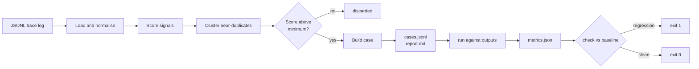

**English** | [简体中文](README.md)

# trace2eval

**Turn production LLM traces into a regression eval set.**

It works the way Pytest does, except the cases are mined from traffic you already
have instead of written by hand.

Zero dependencies. No API keys. No model calls. Same log in, same cases out.

[](https://github.com/rfioly/trace2eval/actions/workflows/ci.yml)
[](https://pypi.org/project/trace2eval-cli/)
[](https://pypi.org/project/trace2eval-cli/)
[](https://pypi.org/project/trace2eval-cli/)
[](#)
[](LICENSE)

---

## Quick start

```bash
pip install trace2eval-cli

# 1. Turn a log into a case set
trace2eval build traces.jsonl -o evalset/

# 2. Score a batch of outputs against those cases
trace2eval run --cases evalset/cases.jsonl --outputs outputs.jsonl -o runs/current.json

# 3. Fail if anything regressed (exit code 1) — drop straight into CI
trace2eval check --baseline runs/baseline.json --current runs/current.json
```

Requires Python 3.10+.

> The distribution name carries a `-cli` suffix because the plain name `trace2eval`
> is held on PyPI by an empty placeholder. **The command is unchanged** — you still
> run `trace2eval`.

---

## Three commands

| Command | What it does |
| --- | --- |
| `build` | JSONL trace log → case set (`cases.jsonl` + `report.md`) |
| `run` | case set + a batch of outputs → `metrics.json` |
| `check` | two metrics files → pass / fail |

---

## Highlights

- **Zero dependencies, no API keys.** Standard library only, no model calls, runs entirely offline.
- **Deterministic.** The same log produces the same case set, byte for byte — asserted in CI.
- **One question, one case.** A question asked 200 times becomes a single case that knows it stands for 200 calls.
- **Shapes are learned from clean answers, never from the one that failed.** A failure seed's minimum length comes from the median of the clean answers to the same question.
- **Every case grades itself.** The report marks the cases whose checks *cannot* catch the failure they came from, instead of folding them into "covered".
- **Cases no check can reach can be annotated by hand.** When a failure happened around the call rather than in the answer, the tool says so and writes a fill-in template; a written expectation turns those cases into real gates. Annotations are keyed on the question, so they survive regenerating the case set.
- **Swappable matcher.** `--similarity module:function` points at your own implementation; the package stays dependency-free.
- **The threshold has outside evidence.** 0.60 was measured on 1,062 hand-labelled SQuAD questions: recall 1.000, false-positive rate 0.004, and the best value on the hardest negative class. Method and caveats are in [`benchmarks/`](benchmarks/).
- **CI-ready.** `check` exits non-zero on regression.

---

## Example run

```console
$ trace2eval build examples/sample_traces.jsonl -o evalset
read 42 traces from examples/sample_traces.jsonl
generated 16 cases -> evalset/cases.jsonl
  8 collapsed as near-duplicates
  3 case(s) carry checks that cannot detect the failure they came from
report -> evalset/report.md
```

42 calls → 16 cases. Every case records why it was picked, where its shape came from, and its self-check verdict:

```markdown
| Case     | Score | In log | Shape from                     | Self-check             | Input                    |
| -------- | ----- | ------ | ------------------------------ | ---------------------- | ------------------------ |
| case-001 | 8.0   | 1      | the log's short-answer line    | ok                     | 订单一直显示处理中，已经三天了 |
| case-007 | 4.5   | 6      | 5 clean answers to the same …  | ok                     | 你们的退款政策是什么？       |
| case-011 | 2.5   | 4      | 3 clean answers to the same …  | failure_not_reproduced | 修改手机号                |
```

Now the gate. A prompt tweak fixes one thing and breaks five others:

```console
$ trace2eval check --baseline runs/baseline.json --current runs/current.json
| Metric                  | Baseline | Current | Rule                                |
| ----------------------- | -------- | ------- | ----------------------------------- |
| pass_rate               | 1.0000   | 0.6875  | dropped by 0.3125 (allowed 0.0200)  |
| format_compliance_rate  | 1.0000   | 0.5000  | dropped by 0.5000 (allowed 0.0200)  |
| fallback_rate           | 0        | 0.0625  | rose by 0.0625 (allowed 0.0200)     |

FAIL: 3 regression(s) detected
$ echo $?
1
```

The five failures span three failure modes:

```
case-001: min_chars                 <- answer truncated
case-002: not_fallback, min_chars   <- gave up instead of answering
case-004: json                      <- declared JSON contract dropped
case-007: min_chars
case-011: min_chars
```

---

## How it picks cases



Every trace is scored by weighted signals, and the score decides what gets promoted. The signals and weights are at the top of `signals.py`:

| Signal | Weight | Why it is a signal |
| --- | --- | --- |
| `negative_feedback` | 3.0 | The user already told you it was wrong. |
| `empty_output` | 3.0 | Nothing was returned at all. |
| `expected_shape_violated` | 3.0 | A declared contract (e.g. JSON) was not met. |
| `user_retried` | 2.5 | They had to ask twice, so the first answer failed. |
| `fallback_phrase` | 2.0 | The assistant gave up instead of answering. |
| `explicit_expectation` | 2.0 | The trace already carried its own assertion. |
| `output_much_shorter` | 1.5 | Likely truncation, judged against the log median. |
| `output_much_longer` | 1.0 | Usually an uncontrolled ramble. |
| `slow_response` | 1.0 | Above the log's p95 latency. |
| `expensive_call` | 1.0 | Above the log's p95 cost. |

The full argument behind every trade-off is in [`DECISIONS.en.md`](DECISIONS.en.md).

---

## Input format

One JSON object per line. Only `input` and `output` are required, and common aliases (`prompt`/`response`, `question`/`completion`, …) are accepted.

```json
{
  "id": "req-0042",
  "input": "账单为什么变多了",
  "output": "账单增加通常是因为套餐在到期后自动续费……",
  "latency_ms": 830,
  "cost_usd": 0.00027,
  "feedback": "negative",
  "retried": true,
  "expect": { "json": true, "required": ["status"], "contains": ["已受理"] }
}
```

Malformed lines and lines with no input are skipped and counted. An **empty `output` is not a bad row** — it is one of the most valuable rows in the log.

---

## Expectations (optional)

Some failures happen *around* the call — the user asked again, left a down-vote, or the request timed out. **The answer itself is usually fine**, which is exactly why no check on the output text can catch the failure. The tool can identify those cases, but it cannot invent what a correct answer should have looked like. A person has to write that down.

`build` writes a fill-in template beside the case set, listing precisely those cases:

```jsonl
{"input": "修改手机号", "expect": {}, "note": "TODO: fill in expect. (user_retried)"}
```

Fill in `expect`, save it as `expectations.jsonl`, and rebuild:

```jsonl
{"input": "修改手机号", "expect": {"min_chars": 20, "contains": ["手机号"]}, "note": "the user asked twice, so v1 did not solve it; a correct answer must explain the verification step"}
```

The keys available inside `expect` are **the same vocabulary a trace's own `expect` block uses**: `min_chars`, `max_chars`, `contains`, `not_contains`, `regex`, `json`, `not_fallback`.

Two design decisions worth knowing:

- **Keyed on the question, not the case id.** Case ids are assigned in descending score order, so adding one trace to a log can renumber everything. An annotation hanging off `case-011` would silently detach on the next rebuild — and a detached annotation is worse than none, because the case still looks covered.
- **An annotation does not change the self-check verdict.** It cannot make the case reproduce its original failure, because for a behavioural failure there is nothing in the text to reproduce. It changes the goal instead: from "make this failure impossible" to "the answer must look like this". The report reports both numbers separately rather than merging them.

---

## Known limits

- **Similarity is character n-grams**, so paraphrases sharing no characters score zero. Against sentence pairs built specifically to defeat string matching, 98% are called "the same question" — that is the ceiling on this approach. Use `--similarity` to swap in your own matcher.
- **Single linkage amplifies a small pairwise error.** On 1,062 SQuAD questions containing **no duplicates at all**, the 0.60 threshold produced a pairwise false-positive rate of 0.4% — which single linkage turned into **54% of the pool landing in some cluster**, the largest holding 425 rows. `report.md` prints the equivalent numbers for your own log (largest cluster, share pulled in). There is **no automatic warning**, because a short fragment scoring far from its parent is the signature of both a useful chain and a spurious one. The reasoning is in the `ClusterHealth` docstring.
- **Behavioural failures cannot be caught automatically, but they can be annotated.** Three of the sixteen cases in the sample log failed only because the user asked again; the output itself was fine, and no deterministic check on text can catch that. It is a limit of the method, not unpaid debt. Those cases are now backed by the hand-written expectations in `evalset/expectations.jsonl` (the committed one is an example). The report keeps the two numbers apart — "cannot be caught" and "covered by an annotation" — rather than merging them into one flattering figure.
- **Comparison cost is O(cases × distinct phrasings per cluster)**, not O(log size): a question asked 5,000 times leaves one fingerprint to compare against. `MAX_DISTINCT_FINGERPRINTS = 512` is a guessed safety valve and has not been load-tested.
- **The signal layer is still unvalidated by outside data.** The benchmark above covers clustering and dedup only. Signals — feedback, retries, latency, cost — decide which traces become cases at all, and no public dataset pairs real text with real operational fields: serving traces have the timing but strip the text, conversation logs have the text but no timing. So the half of this tool that decides *what is worth testing* still rests on that 42-row sample log.
- **Cases are still a proposal**, but a self-checking one — `report.md` lists the ones that need a human eye.

---

## Repository layout

```
src/trace2eval/
  schema.py       trace loading, alias handling, tolerant parsing
  signals.py      what makes a trace worth testing
  select.py       similarity, clustering, case construction
  checks.py       deterministic output checks
  runner.py       scoring and regression comparison
  report.py       markdown rendering
  matchers.py     swappable similarity
  annotations.py  loading and merging hand-written expectations
tests/            62 tests
examples/         a 42-row sample log plus a baseline and a regressed run
evalset/          committed build output plus example expectations
benchmarks/       the dedup threshold measured against outside labelled data
```

## Development

```bash
pip install -e ".[dev]"
pytest
```

After changing anything that affects the committed artefacts, run `python rebuild.py`.
It rebuilds `evalset/`, the metrics the examples depend on, and `benchmarks/results.md`
in the required order, then checks for stray BOMs and CRLF. (Skipping this step once
broke the CI byte-identity assertion, which is why it became a script.)

## License

MIT
