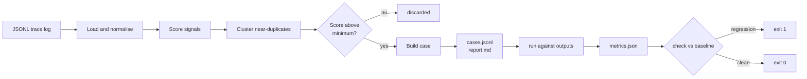

**English** | [简体中文](README.md)

---

# trace2eval

**Production logs tell you what broke. They don't tell you what to test next.**

`trace2eval` reads a JSONL log of LLM calls and turns it into a regression eval
set — automatically, deterministically, and offline.

```bash
trace2eval build    traces.jsonl -o evalset/     # log       -> case set
trace2eval run      --cases evalset/cases.jsonl \
                    --outputs outputs.jsonl \
                    -o runs/current.json          # case set  -> metrics
trace2eval check    --baseline runs/baseline.json \
                    --current  runs/current.json  # metrics   -> pass / fail
```

Zero dependencies. No API keys. No model calls. `check` exits non-zero on
regression, so it drops straight into CI.

---

## What this is, in one picture

Think of an AI application as **a student sitting thousands of exams a day**.

Some answers are wrong — a user gives a thumbs-down, the reply comes back empty,
the model says *"As an AI, I can't help with that."*

**A wrong answer you don't write down is a wrong answer you will make again.** But
no student can read through thousands of papers a day and pick out the ones worth
revising. So in practice somebody scrolls the log and guesses, and the same
mistakes keep shipping.

`trace2eval` is the thing that keeps the notebook for you.

| The student's world | The AI's world |
| --- | --- |
| Thousands of exam questions a day | Thousands of LLM calls in your production log |
| The ones the teacher marked wrong | Thumbs-down feedback, retries, empty replies, fallback phrases, timeouts |
| The same mistake, again and again | One question asked 200 times, answered badly once |
| The mistake notebook | The regression eval set (`cases.jsonl`) |
| The must-do list before the next exam | The CI gate that runs on every prompt change |

---

## The gap this fills

Tracing tools record what happened. Eval frameworks score cases you already
wrote. Nothing connects the two.

```
production traffic -> [ record traces ] -> ( ? ) -> [ eval + gate ]
                        Langfuse,          ^        DeepEval,
                        Arize Phoenix      |        Ragas, promptfoo
                                           |
                              This step is still done by hand:
                              someone scrolls the log and picks samples.
```

`trace2eval` is that middle step. It is deliberately not another eval framework
and not another tracing backend — it consumes the output of the first and
produces the input of the second.

---

## What "worth testing" means

Every trace is scanned for cheap, deterministic signals. The weights add up into
a score, and the score decides what gets promoted.

| Signal | Weight | Why it is a signal |
| --- | --- | --- |
| `negative_feedback` | 3.0 | The user already told you it was wrong. |
| `empty_output` | 3.0 | Nothing was returned at all. |
| `expected_shape_violated` | 3.0 | A declared contract (e.g. JSON) was not met. |
| `user_retried` | 2.5 | They had to ask twice, so the first answer failed. |
| `fallback_phrase` | 2.0 | The assistant gave up instead of answering. |
| `explicit_expectation` | 2.0 | The trace already carried its own assertion. |
| `output_much_shorter` | 1.5 | Likely truncation, judged against the log median. |
| `output_much_longer` | 1.0 | Usually an uncontrolled ramble. |
| `slow_response` | 1.0 | Above the log's p95 latency. |
| `expensive_call` | 1.0 | Above the log's p95 cost. |

Then near-duplicates are collapsed, so one question asked two hundred times
becomes one case that honestly records how many calls it stands for.

---

## Demo

Run against the 42-row sample log in `examples/`:

```console
$ trace2eval build examples/sample_traces.jsonl -o evalset
read 42 traces from examples/sample_traces.jsonl
generated 16 cases -> evalset/cases.jsonl
  8 collapsed as near-duplicates
  0 below the minimum score
  0 beyond the case limit
report -> evalset/report.md
```

16 cases from 42 calls. Every case records *why* it was chosen — see
[`evalset/report.md`](evalset/report.md):

```markdown
| Case     | Score | In log | Trusted | Signals                                       | Input                    |
| -------- | ----- | ------ | ------- | --------------------------------------------- | ------------------------ |
| case-001 | 8.0   | 1      | no      | negative_feedback, user_retried, output_much… | 订单一直显示处理中，已经三天了 |
| case-007 | 4.5   | 6      | no      | negative_feedback, output_much_shorter        | 你们的退款政策是什么？       |
| case-011 | 2.5   | 4      | no      | user_retried                                  | 修改手机号                |
```

`case-007` is the one to look at. Six different phrasings of the refund question
went into the log; they became **one** case that knows it stands for six calls.

Now the gate. A prompt tweak fixes one thing and quietly breaks three others:

```console
$ trace2eval check --baseline runs/baseline.json --current runs/current.json
...
| Metric                  | Baseline | Current | Rule                                |
| ----------------------- | -------- | ------- | ----------------------------------- |
| pass_rate               | 1.0000   | 0.8750  | dropped by 0.1250 (allowed 0.0200)  |
| format_compliance_rate  | 1.0000   | 0.5000  | dropped by 0.5000 (allowed 0.0200)  |
| fallback_rate           | 0        | 0.0625  | rose by 0.0625 (allowed 0.0200)     |

FAIL: 3 regression(s) detected
$ echo $?
1
```

Reproduce all of the above locally — it is the exact sequence in
[`.github/workflows/ci.yml`](.github/workflows/ci.yml).

---

## How it works



Two design rules do most of the work, and both are explained in
[`DECISIONS.en.md`](DECISIONS.en.md):

**A reference output is not ground truth.** Most selected traces are selected
*because* something went wrong with them. So an expected shape is only inferred
from the output when the trace looks clean; everything else becomes a *regression
seed* — a case that exists to make sure the same failure never ships twice. The
report marks which is which under `Trusted`.

**Surface similarity is the wrong tool for short queries.** We use the overlap
coefficient rather than Jaccard, because on this log Jaccard ranks two genuinely
different questions (0.400) above two phrasings of the same question (0.333).
The full measurement, including the threshold sweep, is in `DECISIONS.en.md` and
is pinned by `tests/test_dedup.py`.

---

## Input format

One JSON object per line. Only `input` and `output` are required, and common
aliases (`prompt`/`response`, `question`/`completion`, …) are accepted.

```json
{
  "id": "req-0042",
  "input": "账单为什么变多了",
  "output": "账单增加通常是因为套餐在到期后自动续费……",
  "latency_ms": 830,
  "cost_usd": 0.00027,
  "feedback": "negative",
  "retried": true,
  "expect": { "json": true, "required": ["status"], "contains": ["已受理"] }
}
```

A malformed line, or a line with no input, is skipped and counted — a single bad
row in a 200,000-line log never costs you the batch.

An **empty `output` is not a bad row.** It is one of the most valuable rows in the
log: it means the model returned nothing.

---

## What this does not do

Stated up front, because a tool that overstates itself is worse than a small one
that does not.

- **No semantic understanding.** Similarity is character n-grams. Two paraphrases
  that share no characters are treated as different questions. Recall on
  paraphrase is a known weakness, not an oversight.
- **Failure seeds carry no shape.** A case derived from a bad output only asserts
  "this must not fall back". It will not notice a *differently* wrong answer.
  Inferring a minimum length from the clean answers to the same question is the
  obvious next step.
- **No LLM-as-judge.** Open-ended quality ("is this answer good?") is out of
  scope by design. Judge models cost money and go quiet in CI; everything here is
  a pure function of the output string.
- **Nothing is validated for you.** Generated cases are a *proposal*. Read
  `report.md` before committing a case set.
- **Occurrence counting is O(cases × log size).** Fine to roughly 10k rows; past
  that, cluster on a blocking key. Not yet implemented.

---

## Repository layout

```
src/trace2eval/
  schema.py    trace loading, alias handling, tolerant parsing
  signals.py   what makes a trace worth testing
  select.py    similarity, clustering, case construction   <- the interesting part
  checks.py    deterministic output checks
  runner.py    scoring and regression comparison
  report.py    markdown rendering
tests/         25 tests; the dedup ones encode measured trade-offs
examples/      a 42-row sample log plus a baseline and a regressed run
evalset/       committed build output, so you can read it without running anything
```

## Status

v0.1.0 — usable, honest about its edges. The three things worth doing next are
in [`DECISIONS.en.md`](DECISIONS.en.md#what-to-do-next).

## License

MIT
