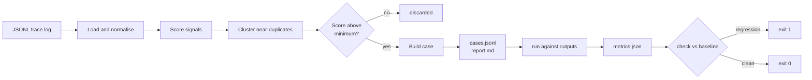

**English** | [简体中文](README.md)

---

# trace2eval

**Production logs tell you what broke. They don't tell you what to test next.**

`trace2eval` reads a JSONL log of LLM calls and turns it into a regression eval
set — automatically, deterministically, and offline.

```bash
trace2eval build    traces.jsonl -o evalset/     # log       -> case set
trace2eval run      --cases evalset/cases.jsonl \
                    --outputs outputs.jsonl \
                    -o runs/current.json          # case set  -> metrics
trace2eval check    --baseline runs/baseline.json \
                    --current  runs/current.json  # metrics   -> pass / fail
```

Zero dependencies. No API keys. No model calls. `check` exits non-zero on
regression, so it drops straight into CI.

---

## What this is, in one picture

Think of an AI application as **a student sitting thousands of exams a day**.

Some answers are wrong — a user gives a thumbs-down, the reply comes back empty,
the model says *"As an AI, I can't help with that."*

**A wrong answer you don't write down is a wrong answer you will make again.** But
no student can read through thousands of papers a day and pick out the ones worth
revising. So in practice somebody scrolls the log and guesses, and the same
mistakes keep shipping.

`trace2eval` is the thing that keeps the notebook for you.

| The student's world | The AI's world |
| --- | --- |
| Thousands of exam questions a day | Thousands of LLM calls in your production log |
| The ones the teacher marked wrong | Thumbs-down feedback, retries, empty replies, fallback phrases, timeouts |
| The same mistake, again and again | One question asked 200 times, answered badly once |
| The mistake notebook | The regression eval set (`cases.jsonl`) |
| The must-do list before the next exam | The CI gate that runs on every prompt change |

---

## The gap this fills

Tracing tools record what happened. Eval frameworks score cases you already
wrote. Nothing connects the two.

```
production traffic -> [ record traces ] -> ( ? ) -> [ eval + gate ]
                        Langfuse,          ^        DeepEval,
                        Arize Phoenix      |        Ragas, promptfoo
                                           |
                              This step is still done by hand:
                              someone scrolls the log and picks samples.
```

`trace2eval` is that middle step. It is deliberately not another eval framework
and not another tracing backend — it consumes the output of the first and
produces the input of the second.

---

## What "worth testing" means

Every trace is scanned for cheap, deterministic signals. The weights add up into
a score, and the score decides what gets promoted.

| Signal | Weight | Why it is a signal |
| --- | --- | --- |
| `negative_feedback` | 3.0 | The user already told you it was wrong. |
| `empty_output` | 3.0 | Nothing was returned at all. |
| `expected_shape_violated` | 3.0 | A declared contract (e.g. JSON) was not met. |
| `user_retried` | 2.5 | They had to ask twice, so the first answer failed. |
| `fallback_phrase` | 2.0 | The assistant gave up instead of answering. |
| `explicit_expectation` | 2.0 | The trace already carried its own assertion. |
| `output_much_shorter` | 1.5 | Likely truncation, judged against the log median. |
| `output_much_longer` | 1.0 | Usually an uncontrolled ramble. |
| `slow_response` | 1.0 | Above the log's p95 latency. |
| `expensive_call` | 1.0 | Above the log's p95 cost. |

Then near-duplicates are collapsed, so one question asked two hundred times
becomes one case that honestly records how many calls it stands for.

---

## Demo

Run against the 42-row sample log in `examples/`:

```console
$ trace2eval build examples/sample_traces.jsonl -o evalset
read 42 traces from examples/sample_traces.jsonl
generated 16 cases -> evalset/cases.jsonl
  8 collapsed as near-duplicates
  0 below the minimum score
  0 beyond the case limit
report -> evalset/report.md
```

16 cases from 42 calls. Every case records *why* it was chosen and where its
expected shape came from — see [`evalset/report.md`](evalset/report.md):

```markdown
| Case     | Score | In log | Trusted | Shape from                     | Self-check             | Input                    |
| -------- | ----- | ------ | ------- | ------------------------------ | ---------------------- | ------------------------ |
| case-001 | 8.0   | 1      | no      | the log's short-answer line    | ok                     | 订单一直显示处理中，已经三天了 |
| case-007 | 4.5   | 6      | no      | 5 clean answers to the same …  | ok                     | 你们的退款政策是什么？       |
| case-011 | 2.5   | 4      | no      | 3 clean answers to the same …  | failure_not_reproduced | 修改手机号                |
```

`case-007` is the one to look at. Six phrasings of the refund question went into
the log and became **one** case — and its minimum length was learned from those
six *clean* answers, not from the one that failed.

`case-011`'s `failure_not_reproduced` is worth a look too: it flags a case whose
checks cannot catch the failure it came from. That is a self-reported weak spot,
not a miss. More on that below.

Now the gate. A prompt tweak fixes one thing and quietly breaks five others:

```console
$ trace2eval check --baseline runs/baseline.json --current runs/current.json
...
| Metric                  | Baseline | Current | Rule                                |
| ----------------------- | -------- | ------- | ----------------------------------- |
| pass_rate               | 1.0000   | 0.6875  | dropped by 0.3125 (allowed 0.0200)  |
| format_compliance_rate  | 1.0000   | 0.5000  | dropped by 0.5000 (allowed 0.0200)  |
| fallback_rate           | 0        | 0.0625  | rose by 0.0625 (allowed 0.0200)     |

FAIL: 3 regression(s) detected
$ echo $?
1
```

The five failures break down like this:

```
case-001: min_chars                                    <- answer truncated
case-002: not_fallback, min_chars                      <- gave up instead of answering
case-004: json                                         <- declared JSON contract dropped
case-007: min_chars
case-011: min_chars
```

Reproduce all of the above locally — it is the exact sequence in
[`.github/workflows/ci.yml`](.github/workflows/ci.yml).

---

## How it works



Two design rules do most of the work, and both are explained in
[`DECISIONS.en.md`](DECISIONS.en.md):

**A reference output is not ground truth.** Most selected traces are selected
*because* something went wrong with them, so inferring an expected shape from the
bad output is inferring a shape from a failure. It took two attempts to get right.
The first version asserted nothing but "must not fall back", and it turned out to
wave truncation straight through — an answer cut down to `订单处理中。` passed. The
second version infers the shape from the **clean answers to the same question**,
which is where the refund case's minimum length comes from: the median of the six
answers that were fine. When a question has no clean answer anywhere but the failure
itself was "this answer is too short", the line it fell below is used instead. That
one is a **weak reference** — flagged as such in the report, and the first number to
revisit when tuning.

**Surface similarity is the wrong tool for short queries.** We use the overlap
coefficient rather than Jaccard, because on this log Jaccard ranks two genuinely
different questions (0.400) above two phrasings of the same question (0.333).
The full measurement, including the threshold sweep, is in `DECISIONS.en.md` and
is pinned by `tests/test_dedup.py`.

---

## Input format

One JSON object per line. Only `input` and `output` are required, and common
aliases (`prompt`/`response`, `question`/`completion`, …) are accepted.

```json
{
  "id": "req-0042",
  "input": "账单为什么变多了",
  "output": "账单增加通常是因为套餐在到期后自动续费……",
  "latency_ms": 830,
  "cost_usd": 0.00027,
  "feedback": "negative",
  "retried": true,
  "expect": { "json": true, "required": ["status"], "contains": ["已受理"] }
}
```

A malformed line, or a line with no input, is skipped and counted — a single bad
row in a 200,000-line log never costs you the batch.

An **empty `output` is not a bad row.** It is one of the most valuable rows in the
log: it means the model returned nothing.

---

## Where the edges are

v0.1 listed four weak spots here. v0.2 dealt with all four. What is left is a real
boundary rather than unpaid debt.

**Semantics.** Similarity is still character n-grams, so two paraphrases sharing no
characters score zero. I am not going to fix that by taking on a dependency — but it
is *swappable*: `--similarity module:function` takes your own `(str, str) -> float`,
so you can point it at an embedding model you already have while this package stays
dependency-free. Two alternative matchers ship alongside it, plus the measured
counter-example showing they are coarser than the default on Chinese. Do not just
reach for them.

**Behavioural failures are invisible to this.** Three of the sixteen cases in the
sample log failed because *the user asked again* — the output itself was fine. No
deterministic check on output text can catch that. It is a limit of the method, not
a gap in the implementation. Those cases are still worth keeping: they pin the input
and hold the line on "must not fall back". But gating them properly needs a
**human-labelled expected answer**, and this tool does not produce one. `report.md`
lists them separately instead of folding them into "covered".

**Similarity comparison is O(cases × distinct phrasings per cluster).** Note: not
O(cases × log size). A question asked 5,000 times leaves one fingerprint to compare
against, not 5,000. Past 512 distinct phrasings in one cluster, extra rows start
their own cluster — which produces duplicate cases rather than missed ones. Prefer
duplicates over misses. The 512 is a guess and has not been load-tested, so treat it
as a starting point. Honestly, I have not run this against a ten-million-row log yet.

**No LLM-as-judge.** Open-ended quality ("is this answer good?") is out of scope by
design. Judge models cost money and go quiet in CI, and DeepEval, Ragas and
promptfoo already do that job well. Everything here is a pure function of the output
string.

**Generated cases are still a proposal.** But now a proposal that *checks itself*:
every case runs its own checks against its own reference output, and the verdict
lands in `report.md`. A "clean" case that fails its own checks gets listed for you.


---

## Repository layout

```
src/trace2eval/
  schema.py    trace loading, alias handling, tolerant parsing
  signals.py   what makes a trace worth testing
  select.py    similarity, clustering, case construction   <- the interesting part
  checks.py    deterministic output checks
  runner.py    scoring and regression comparison
  report.py    markdown rendering
  matchers.py  swappable similarity, including a usable counter-example
tests/         42 tests; the dedup ones encode measured trade-offs
examples/      a 42-row sample log plus a baseline and a regressed run
evalset/       committed build output, so you can read it without running anything
```

## Status

v0.2.0. Three and a half of v0.1's four weak spots are closed; the half that remains
is a limit of the method, written up under [Where the edges are](#where-the-edges-are).
What I would do next is in
[`DECISIONS.en.md`](DECISIONS.en.md#what-to-do-next).

What changed between versions:

| | |
| --- | --- |
| v0.1.0 | Worked. Failure seeds asserted only "must not fall back", so truncated answers slipped through. |
| v0.2.0 | Failure seeds learn their shape from clean answers to the same question, with the log's short-answer line as a fallback; every case self-checks against its own reference; clusters deduplicate by phrasing so cost stops growing with repetition; the matcher is swappable. |

## License

MIT
