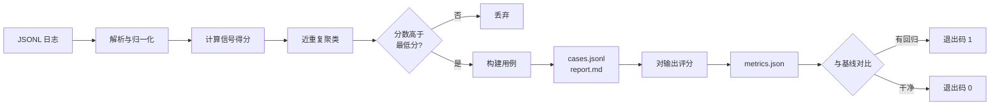

[English](README.en.md) | **简体中文**

# trace2eval

**让 LLM 应用改不坏。** 它读你的生产日志，把已经出过问题的调用挑出来，变成一套每次改动都会跑的回归测试集。

说白了：上一版还答得对的问题，这一版答砸了，你提交前就会知道，而不是等用户来投诉。

```bash
trace2eval build    traces.jsonl -o evalset/     # 日志      -> 用例集
trace2eval run      --cases evalset/cases.jsonl \
                    --outputs outputs.jsonl \
                    -o runs/current.json          # 用例集    -> 指标
trace2eval check    --baseline runs/baseline.json \
                    --current  runs/current.json  # 指标      -> 通过 / 失败
```

零依赖，不用 API key，也不调任何模型。`check` 一旦查到回归就返回非零退出码，直接丢进 CI 就行。

两个旋钮，都可以不碰：`--dedup-threshold` 调去重松紧（默认 0.6），`--similarity module:function` 换掉内置的相似度实现。

---

## 先跑一遍

`examples/` 里有一份 42 行的样本日志：

```console
$ trace2eval build examples/sample_traces.jsonl -o evalset
read 42 traces from examples/sample_traces.jsonl
generated 16 cases -> evalset/cases.jsonl
  8 collapsed as near-duplicates
  0 below the minimum score
  0 beyond the case limit
report -> evalset/report.md
```

42 次调用里挑出 16 个用例，另外 8 行因为跟别的行是同一个问题被折叠掉了。每个用例都会说明自己为什么被挑中、期望形状是从哪儿来的，`evalset/report.md` 里有完整的：

```markdown
| Case     | Score | In log | Trusted | Shape from                     | Self-check             | Input                    |
| -------- | ----- | ------ | ------- | ------------------------------ | ---------------------- | ------------------------ |
| case-001 | 8.0   | 1      | no      | 日志的短答线（弱参考）           | ok                     | 订单一直显示处理中，已经三天了 |
| case-007 | 4.5   | 6      | no      | 同一问题的 5 个干净答案          | ok                     | 你们的退款政策是什么？       |
| case-011 | 2.5   | 4      | no      | 同一问题的 3 个干净答案          | failure_not_reproduced | 修改手机号                |
```

`case-007` 那行可以多看一眼。退款这个问题在日志里出现了六种问法，最后合成一个用例；它的长度下限是从**那六条干净答案**里推出来的，不是从出错的那条推的。

`case-011` 的 `failure_not_reproduced` 也值得看：它标记的是"这个用例的检查抓不住它当初为什么坏"。这是自愿暴露的短板，不是漏报——下面还会说。

然后看门禁。假设某次改提示词修好了一处、顺手弄坏了五处：

```console
$ trace2eval check --baseline runs/baseline.json --current runs/current.json
...
| Metric                  | Baseline | Current | Rule                                |
| ----------------------- | -------- | ------- | ----------------------------------- |
| pass_rate               | 1.0000   | 0.6875  | dropped by 0.3125 (allowed 0.0200)  |
| format_compliance_rate  | 1.0000   | 0.5000  | dropped by 0.5000 (allowed 0.0200)  |
| fallback_rate           | 0        | 0.0625  | rose by 0.0625 (allowed 0.0200)     |

FAIL: 3 regression(s) detected
$ echo $?
1
```

那五个失败长这样：

```
case-001: min_chars                                    <- 答案被截断
case-002: not_fallback, min_chars                      <- 直接放弃作答
case-004: json                                         <- 声明过的 JSON 契约没兑现
case-007: min_chars
case-011: min_chars
```

上面这些都能在本地复现，顺序和 [`.github/workflows/ci.yml`](.github/workflows/ci.yml) 里一致。

---

## 为什么这么设计

先说不那么明显的那几个。

**相似度我用的是重叠系数，不是 Jaccard。** 这个改得比较晚。一开始按常识用了 Jaccard，结果在这份日志上它把两个**不同**的问题排得比两个**同义**的问法还高。既然是排序错了，调阈值就没意义了，只能换度量。完整的那几组数我记在 `DECISIONS.md` 里了。

不过这里得说清楚：我这份样本只有 42 行，所以"Jaccard 排序反了"这个结论，**我不太确定放到几万行的真实中文语料上是不是还站得住**。字段名可能准，量级不敢保证。

**去重阈值定在 0.6，是扫出来的。** 0.5 会把"支持哪些登录方式"和"支持哪些支付方式"合并成一个 —— 这俩明显不是一回事。0.65 往上又开始漏真重复。0.6 是这中间勉强干净的一点。

但这也就是在一份 42 行样本上试出来的，**大概率有更好的定法，我暂时没找到**。所以我把它暴露成 `--dedup-threshold`，你拿自己的流量重扫一遍就行。

**聚类是在整份日志上跑，不是只在候选集上跑。** 这点不太起眼但挺关键。要是先筛出候选再在候选里做去重，那个"被问了 200 次、只崩过 1 次"的问题就会被报成"出现 1 次"——数字直接是假的。先给全量聚类，再说哪些簇值得提拔，才能老实说一句这个用例代表 200 次调用。

**参考输出不等于标准答案。** 这条是后来才想明白的，而且改了两版才对。

大部分被选中的 trace，恰恰是因为它出错了才被选中的——从一个失败的输出里推"期望形状"，基本等于从失败里学标准。

所以第一版只断言"不许兜底"，然后就发现漏得厉害：把答案截断成 `订单处理中。` 照样过关。第二版改成从**同一个问题的干净答案**里推形状——不是从这一条，是从日志里所有把这个问题答对了的那些条。退款那个用例的长度下限就是这么来的：六条干净答案的中位数。

要是一条干净答案都没有呢？如果失败本身就是"答案太短"，那至少知道它是从哪条线掉下去的，就拿那条线当下限。这是个**弱参考**（来自全日志的中位数，不是这个名字的问题的中位数），`report.md` 里会明确标出来，也是调参时第一个该回头看的数字。

`min_chars` 放在参考长度的 40%。这个数是我拍的，目的是抓截断，不是抓改述。凡是会因为合理改写就报红的检查，基本上活不过一周就会被关掉。

**不做 LLM 裁判。** 钱、不确定性，还有一点：DeepEval、Ragas、promptfoo 已经把这事做得挺好了，我再造一个没意义。这块的取舍我不太确定是不是最优解——可能有人觉得有个裁判模型能测的东西更多。但目前这个选择让整个工具保持"同样的日志出同样的结果"，我觉得值。

---

## 边界在哪

v0.1 里这一节列了四条短板。v0.2 把它们逐个处理了，剩下的是真边界，不是欠账。

**语义。** 相似度仍然是字符 n-gram，所以两个不含相同字符的改写会被当成两个问题。这条我修不了，也不打算靠引依赖去修——但它是**可以换的**：`--similarity module:function` 能塞进你自己的 embedding 函数，包本身照样零依赖。随包带了两个替代匹配器当例子，也带了实测出来的反例：在中文上它们比默认的更粗，别直接拿去用。

**行为型失败抓不住。** 样本日志 16 个用例里有 3 个，失败原因只是"用户又问了一遍"，输出本身没毛病。任何对输出文本的确定性检查都抓不到这种。这是方法的边界，不是实现的漏洞。这 3 个仍然值得留着——它们钉住了输入，也守住了"不许兜底"这条下限——但要真拦住它，得有一个**人工标注的期望答案**，而这个工具不产出那个。`report.md` 会把它们单独列出来，不会混进"已覆盖"里蒙混过去。

**相似度比较是 O(用例数 × 每个簇的不同问法数)。** 注意不是 O(用例数 × 日志大小)：同一条问题问 5000 次只会留下 1 个待比对的指纹。簇内不同问法超过 512 种时停止纳入，那时候多出来的是重复用例，不是漏掉的用例——宁可重复，不可漏。这个 512 是我拍的，没压测过，仅供参考。说老实话，我也还没在十万行级别的真实日志上跑过。

**生成的用例仍然是提案。** 但现在是**会自我体检的提案**：每个用例都会拿自己的参考输出跑一遍自己的检查，结论写进 `report.md`。一个"干净"用例要是通不过自己的检查，会被单独列出来让你先看。

---

## 输入格式

每行一个 JSON 对象。只有 `input` 和 `output` 必填，常见的别名（`prompt`/`response`、`question`/`completion` 之类）也认。

```json
{
  "id": "req-0042",
  "input": "账单为什么变多了",
  "output": "账单增加通常是因为套餐在到期后自动续费……",
  "latency_ms": 830,
  "cost_usd": 0.00027,
  "feedback": "negative",
  "retried": true,
  "expect": { "json": true, "required": ["status"], "contains": ["已受理"] }
}
```

格式坏掉的一行，或者没有输入的一行，会跳过并计数。二十万行日志里混进一行垃圾，不至于让你损失整批数据。

空的 `output` 不算坏行。它是日志里最有价值的行之一：说明模型什么都没返回。

---

## 仓库结构

```
src/trace2eval/
  schema.py    trace 加载、字段别名、容错解析
  signals.py   一条 trace 为什么值得测
  select.py    相似度、聚类、用例构建
  checks.py    确定性输出检查
  runner.py    评分与回归对比
  report.py    markdown 渲染
  matchers.py  可替换的相似度实现（含一个能直接用的反例）
tests/         42 个测试；去重那几个把实测出来的取舍钉住了
examples/      一份 42 行样本日志，外加一次基线和一次回归运行
evalset/       提交进仓库的构建产物，不用跑任何东西就能读
```

有意思的基本都在 `select.py` 里。`signals.py` 反倒是最直白的那个。

---

## 背景：为什么会有这东西

本来我把这段放在最前面，挪到后面是因为——先看到二十几行命令和一段终端输出，大概就知道它能干什么了；而"为什么需要它"这件事，讲起来反而绕。

一句话版本：记录工具负责存下来，评估框架负责给你写好的用例打分，中间那一步没人做。

```
生产流量 ──> [ 记录 trace ] ──> ( ? ) ──> [ 评估 + 门禁 ]
              Langfuse,           ^        DeepEval,
              Arize Phoenix       |        Ragas, promptfoo
                                  |
                    这一步至今靠手工：
                    有人翻着日志凭感觉挑样本
```

`trace2eval` 就是中间那格。它刻意不做评估框架，也不做追踪后端，只吃前者的输出、产后者的输入。

再说一个我自己更喜欢的说法：把一个 AI 应用想成每天要考几千次试的学生。有的题答错了——用户点了差评、回答是空的、模型回一句"作为一个AI，我无法回答"。错题不记下来，下次还会错。可没有哪个学生能翻完每天几千份卷子，把该复习的挑出来。所以一直以来都是靠人熬夜翻日志、凭感觉选几条。

`trace2eval` 就是那个替你整理错题本的东西。

| 学生的世界 | AI 的世界 |
| --- | --- |
| 每天几千道题 | 生产日志里几千次 LLM 调用 |
| 老师画了红叉的题 | 用户差评、重试、空回答、兜底话术、超时 |
| 同一类题反复错 | 同一个问题被问了 200 次，其中 1 次答砸了 |
| 错题本 | 回归测试集（`cases.jsonl`） |
| 考前必做清单 | CI 里每次改提示词都跑一遍的门禁 |

---

## 它内部怎么走



每个信号单独有多重，加起来的分数决定谁被提拔上来。信号和权重列在 `signals.py` 顶部，改起来就一行的事：

| 信号 | 权重 | 为什么它算信号 |
| --- | --- | --- |
| `negative_feedback` | 3.0 | 用户已经告诉你答错了。 |
| `empty_output` | 3.0 | 什么都没返回。 |
| `expected_shape_violated` | 3.0 | 声明过的契约（比如 JSON）没被满足。 |
| `user_retried` | 2.5 | 他问了两遍，说明第一次没解决。 |
| `fallback_phrase` | 2.0 | 模型放弃回答，而不是作答。 |
| `explicit_expectation` | 2.0 | 这条 trace 自己就带了断言。 |
| `output_much_shorter` | 1.5 | 大概率被截断，和日志中位数比。 |
| `output_much_longer` | 1.0 | 通常是不受控的长篇大论。 |
| `slow_response` | 1.0 | 超过整份日志的 p95 延迟。 |
| `expensive_call` | 1.0 | 超过整份日志的 p95 成本。 |

## 状态

v0.2.0。v0.1 里那四条短板处理掉了三条半，剩下的一条是方法的边界，已经写清楚在
[边界在哪](#边界在哪)。还想往下做的写在 [`DECISIONS.md`](DECISIONS.md#接下来做什么)。

版本之间改了什么：

| | |
| --- | --- |
| v0.1.0 | 能跑。失败种子只断言"不许兜底"，截断的答案能蒙混过关。 |
| v0.2.0 | 失败种子从同一问题的干净答案里学形状；没有干净答案时用日志的短答线兜底；每个用例对自己的参考输出做自检；簇内按不同问法去重（成本不再随重复次数增长）；相似度可插拔。 |

## 许可证

MIT
