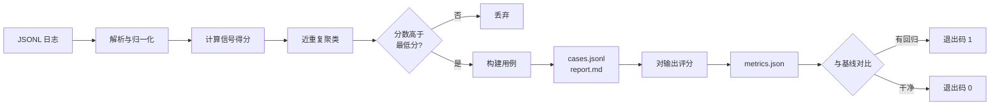

[English](README.en.md) | **简体中文**

---

# trace2eval

**生产日志告诉你哪里崩了。它不会告诉你下一步该测什么。**

`trace2eval` 读一份 LLM 调用的 JSONL 日志，把它自动变成一套回归测试集——全自动、确定性、完全离线。

```bash
trace2eval build    traces.jsonl -o evalset/     # 日志      -> 用例集
trace2eval run      --cases evalset/cases.jsonl \
                    --outputs outputs.jsonl \
                    -o runs/current.json          # 用例集    -> 指标
trace2eval check    --baseline runs/baseline.json \
                    --current  runs/current.json  # 指标      -> 通过 / 失败
```

零依赖、不需要 API key、不调用任何模型。`check` 检出回归就返回非零退出码，可以直接挂进 CI。

---

## 先用一个比喻说清它是干嘛的

把一个 AI 应用想成**一个每天要考几千次试的学生**。

有的题答错了——用户点了差评、回答是空的、模型回了一句"作为一个AI，我无法回答"。

**错题如果不记下来，下次还会错。** 但没有哪个学生能翻完每天几千份卷子，把真正该复习的题挑出来。所以这件事一直是靠人熬夜翻日志、凭感觉选几条。

`trace2eval` 就是那个替你**自动整理错题本**的东西。

| 学生的世界 | AI 的世界 |
| --- | --- |
| 每天几千道题 | 生产日志里几千次 LLM 调用 |
| 老师画了红叉的题 | 用户差评、重试、空回答、兜底话术、超时 |
| 同一类题反复错 | 同一个问题被问了 200 次，其中 1 次答砸了 |
| 错题本 | 回归测试集（`cases.jsonl`） |
| 考前必做清单 | CI 里每次改提示词都跑一遍的门禁 |

---

## 它补的是哪一道缝

记录工具负责"存下来"，评估框架负责"给你已经写好的用例打分"，**中间那一步没人做**。

```
生产流量 ──> [ 记录 trace ] ──> ( ? ) ──> [ 评估 + 门禁 ]
              Langfuse,           ^        DeepEval,
              Arize Phoenix       |        Ragas, promptfoo
                                  |
                    这一步至今靠手工：
                    有人翻着日志凭感觉挑样本
```

`trace2eval` 就是中间那一步。它刻意**不是**另一个评估框架，也**不是**另一个追踪后端——它吃第一个的输出，产第二个的输入。

---

## "值得测"到底怎么判定的

每条 trace 都会被扫一遍，找出成本极低的确定性信号。权重相加得到分数，分数决定谁被提拔上来。

| 信号 | 权重 | 为什么它算信号 |
| --- | --- | --- |
| `negative_feedback` | 3.0 | 用户已经告诉你答错了。 |
| `empty_output` | 3.0 | 什么都没返回。 |
| `expected_shape_violated` | 3.0 | 声明过的契约（比如 JSON）没被满足。 |
| `user_retried` | 2.5 | 他问了两遍，说明第一次没解决。 |
| `fallback_phrase` | 2.0 | 模型放弃回答，而不是作答。 |
| `explicit_expectation` | 2.0 | 这条 trace 自己就带了断言。 |
| `output_much_shorter` | 1.5 | 大概率被截断，和日志中位数比。 |
| `output_much_longer` | 1.0 | 通常是不受控的长篇大论。 |
| `slow_response` | 1.0 | 超过整份日志的 p95 延迟。 |
| `expensive_call` | 1.0 | 超过整份日志的 p95 成本。 |

之后近重复会被折叠，所以一个被问了 200 次的问题只变成**一个**用例，并且老实标注它代表多少次调用。

---

## 实际跑一遍

对着 `examples/` 里那份 42 行的样本日志：

```console
$ trace2eval build examples/sample_traces.jsonl -o evalset
read 42 traces from examples/sample_traces.jsonl
generated 16 cases -> evalset/cases.jsonl
  8 collapsed as near-duplicates
  0 below the minimum score
  0 beyond the case limit
report -> evalset/report.md
```

42 次调用里挑出 16 个用例。每个用例都记录了**它为什么被选中**——见 [`evalset/report.md`](evalset/report.md)：

```markdown
| Case     | Score | In log | Trusted | Signals                                       | Input                    |
| -------- | ----- | ------ | ------- | --------------------------------------------- | ------------------------ |
| case-001 | 8.0   | 1      | no      | negative_feedback, user_retried, output_much… | 订单一直显示处理中，已经三天了 |
| case-007 | 4.5   | 6      | no      | negative_feedback, output_much_shorter        | 你们的退款政策是什么？       |
| case-011 | 2.5   | 4      | no      | user_retried                                  | 修改手机号                |
```

`case-007` 是最值得看的那一行。退款这个问题在日志里被问了六种不同问法，最后变成**一个**用例，并且它知道自己是替 6 次调用站岗。

再看门禁。一次提示词改动修好了一处，同时悄悄弄坏了三处：

```console
$ trace2eval check --baseline runs/baseline.json --current runs/current.json
...
| Metric                  | Baseline | Current | Rule                                |
| ----------------------- | -------- | ------- | ----------------------------------- |
| pass_rate               | 1.0000   | 0.8750  | dropped by 0.1250 (allowed 0.0200)  |
| format_compliance_rate  | 1.0000   | 0.5000  | dropped by 0.5000 (allowed 0.0200)  |
| fallback_rate           | 0        | 0.0625  | rose by 0.0625 (allowed 0.0200)     |

FAIL: 3 regression(s) detected
$ echo $?
1
```

以上全部可以在本地复现——顺序和 [`.github/workflows/ci.yml`](.github/workflows/ci.yml) 里完全一致。

---

## 它内部怎么走



真正撑起这个项目的是两条设计规则，两条都在 [`DECISIONS.md`](DECISIONS.md) 里有完整的论证：

**参考输出不等于标准答案。** 大多数被选中的 trace，恰恰是因为它出错了才被选中的。所以只有在 trace 看起来很干净时，才从它的输出里推断"期望形状"；其余的一律当成**失败种子**——一个存在的意义就是"让同样的错永远不要再上线第二次"的用例。报告里的 `Trusted` 一列标明了哪个是哪个。

**短查询不适合用表面相似度。** 我们用的是重叠系数（overlap coefficient），不是 Jaccard——因为在这份日志上，Jaccard 会把两个**不同**的问题（0.400）排在两个**同义**问法（0.333）之上。完整的实测数据，包括阈值扫描，都在 `DECISIONS.md` 里，并且被 `tests/test_dedup.py` 钉住了。

---

## 输入格式

每行一个 JSON 对象。只有 `input` 和 `output` 是必填的，常见别名（`prompt`/`response`、`question`/`completion` 等）也认。

```json
{
  "id": "req-0042",
  "input": "账单为什么变多了",
  "output": "账单增加通常是因为套餐在到期后自动续费……",
  "latency_ms": 830,
  "cost_usd": 0.00027,
  "feedback": "negative",
  "retried": true,
  "expect": { "json": true, "required": ["status"], "contains": ["已受理"] }
}
```

格式坏掉的一行、或者没有输入的一行，会被跳过并计数——**二十万行日志里混进一行垃圾，绝不会让你损失整批数据。**

**空的 `output` 不是坏行。** 它是日志里最有价值的行之一：它意味着模型什么也没返回。

---

## 它不做什么

写在最前面，因为一个夸大自己的工具，比一个老实的小工具有害得多。

- **没有语义理解。** 相似度是字符 n-gram。两个完全不含相同字符的改写，会被当成两个不同的问题。改写召回率弱是已知短板，不是疏忽。
- **失败种子不带形状。** 从坏输出推导出来的用例，只断言"不许兜底"。它**不会**发现一种"错得不一样"的答案。从同一个问题的干净答案里推导最小长度，是最明显的下一步。
- **不做 LLM 裁判。** 开放式质量（"这个回答好不好"）按设计就在范围外。裁判模型要花钱，而且到了 CI 里就会变哑巴；这里的一切都只是输出字符串的纯函数。
- **不会替你验证。** 生成的用例只是一份**提案**。提交用例集之前，请先读一遍 `report.md`。
- **发生次数统计是 O(用例数 × 日志大小)。** 一万行以内没问题，再多就需要按 blocking key 聚类。目前尚未实现。

---

## 仓库结构

```
src/trace2eval/
  schema.py    trace 加载、字段别名、容错解析
  signals.py   一条 trace 为什么值得测
  select.py    相似度、聚类、用例构建        <- 最有意思的部分
  checks.py    确定性输出检查
  runner.py    评分与回归对比
  report.py    markdown 渲染
tests/         25 个测试；去重那几个把实测出来的取舍钉住了
examples/      一份 42 行样本日志，外加一次基线和一次回归运行
evalset/       提交进仓库的构建产物，不用跑任何东西就能读
```

## 状态

v0.1.0——能用，并且对自己的边界很诚实。接下来最值得做的三件事写在
[`DECISIONS.md`](DECISIONS.md#接下来做什么) 里。

## 许可证

MIT
