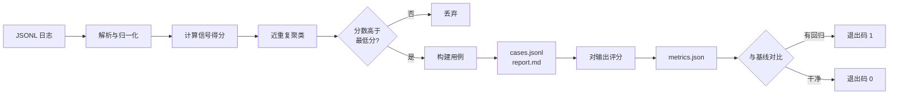

[English](README.en.md) | **简体中文**

# trace2eval

**把生产环境的 LLM 调用日志，变成一套回归测试集。**

它是 Pytest 那个路子，区别在于用例不用手写——从你已经发生的线上调用里挖出来。

零依赖、不用 API key、不调模型。同样的日志进，同样的用例出。

[](https://github.com/rfioly/trace2eval/actions/workflows/ci.yml)
[](https://pypi.org/project/trace2eval-cli/)
[](https://pypi.org/project/trace2eval-cli/)
[](https://pypi.org/project/trace2eval-cli/)
[](#)
[](LICENSE)

---

## 快速开始

```bash
pip install trace2eval-cli

# 1. 把日志变成用例集
trace2eval build traces.jsonl -o evalset/

# 2. 拿用例集给一批输出打分
trace2eval run --cases evalset/cases.jsonl --outputs outputs.jsonl -o runs/current.json

# 3. 有回归就失败（退出码 1），可直接挂 CI
trace2eval check --baseline runs/baseline.json --current runs/current.json
```

需要 Python 3.10+。

> 分发名带 `-cli` 后缀，因为 `trace2eval` 这个名字在 PyPI 上被一个空壳占着。
> **命令没变**——装完还是敲 `trace2eval`。

---

## 三个命令

| 命令 | 做什么 |
| --- | --- |
| `build` | JSONL 调用日志 → 用例集（`cases.jsonl` + `report.md`） |
| `run` | 用例集 + 一批输出 → `metrics.json` |
| `check` | 两份指标对比 → 通过 / 失败 |

---

## 特性

- **零依赖，不用 API key。** 纯标准库，不调任何模型，完全离线可跑。
- **确定性。** 同一份日志产出同一套用例，逐字节一致——这条在 CI 里有断言。
- **一个问题一个用例。** 被问了 200 次的问题只变成一个用例，并且老实记录它代表 200 次调用。
- **形状从干净答案学，不从失败那条学。** 失败种子的长度下限来自同问题的干净答案中位数。
- **每个用例自检。** 报告里会标明哪些用例的检查**抓不住**它当初为什么坏，不混进"已覆盖"里。
- **抓不住的用例可以人工补。** 失败发生在"调用之外"（用户重问、差评）而不在答案里时，自动检查无能为力——报告会把它们单列出来，`build` 同时生成一份待填模板，你写好期望答案后它们就变成真正的门禁。标注按**问题**索引而不是按用例编号，所以重新生成用例集不会失效。
- **相似度可换。** `--similarity module:function` 换成你自己的实现，包本身不引依赖。
- **天生适合 CI。** `check` 检出回归返回非零退出码。

---

## 跑一遍看看

```console
$ trace2eval build examples/sample_traces.jsonl -o evalset
read 42 traces from examples/sample_traces.jsonl
generated 16 cases -> evalset/cases.jsonl
  8 collapsed as near-duplicates
  3 case(s) carry checks that cannot detect the failure they came from
report -> evalset/report.md
```

42 次调用 → 16 个用例。每个用例都记了为什么被挑中、形状从哪来、自检结论：

```markdown
| Case     | Score | In log | Shape from                     | Self-check             | Input                    |
| -------- | ----- | ------ | ------------------------------ | ---------------------- | ------------------------ |
| case-001 | 8.0   | 1      | 日志的短答线（弱参考）           | ok                     | 订单一直显示处理中，已经三天了 |
| case-007 | 4.5   | 6      | 同一问题的 5 个干净答案          | ok                     | 你们的退款政策是什么？       |
| case-011 | 2.5   | 4      | 同一问题的 3 个干净答案          | failure_not_reproduced | 修改手机号                |
```

再看门禁。改一次提示词，修好一处、弄坏五处：

```console
$ trace2eval check --baseline runs/baseline.json --current runs/current.json
| Metric                  | Baseline | Current | Rule                                |
| ----------------------- | -------- | ------- | ----------------------------------- |
| pass_rate               | 1.0000   | 0.6875  | dropped by 0.3125 (allowed 0.0200)  |
| format_compliance_rate  | 1.0000   | 0.5000  | dropped by 0.5000 (allowed 0.0200)  |
| fallback_rate           | 0        | 0.0625  | rose by 0.0625 (allowed 0.0200)     |

FAIL: 3 regression(s) detected
$ echo $?
1
```

五个失败横跨三种失败模式：

```
case-001: min_chars                 <- 答案被截断
case-002: not_fallback, min_chars   <- 直接放弃作答
case-004: json                      <- 声明过的 JSON 契约没兑现
case-007: min_chars
case-011: min_chars
```

---

## 它怎么挑用例



每条 trace 按信号加权重打分，分数决定谁被提拔。信号和权重就在 `signals.py` 顶部：

| 信号 | 权重 | 为什么它算信号 |
| --- | --- | --- |
| `negative_feedback` | 3.0 | 用户已经告诉你答错了。 |
| `empty_output` | 3.0 | 什么都没返回。 |
| `expected_shape_violated` | 3.0 | 声明过的契约（比如 JSON）没被满足。 |
| `user_retried` | 2.5 | 他问了两遍，说明第一次没解决。 |
| `fallback_phrase` | 2.0 | 模型放弃回答，而不是作答。 |
| `explicit_expectation` | 2.0 | 这条 trace 自己就带了断言。 |
| `output_much_shorter` | 1.5 | 大概率被截断，和日志中位数比。 |
| `output_much_longer` | 1.0 | 通常是不受控的长篇大论。 |
| `slow_response` | 1.0 | 超过整份日志的 p95 延迟。 |
| `expensive_call` | 1.0 | 超过整份日志的 p95 成本。 |

设计取舍的完整论证在 [`DECISIONS.md`](DECISIONS.md)。

---

## 输入格式

每行一个 JSON 对象，只有 `input` 和 `output` 必填，常见别名（`prompt`/`response`、`question`/`completion` 等）也认。

```json
{
  "id": "req-0042",
  "input": "账单为什么变多了",
  "output": "账单增加通常是因为套餐在到期后自动续费……",
  "latency_ms": 830,
  "cost_usd": 0.00027,
  "feedback": "negative",
  "retried": true,
  "expect": { "json": true, "required": ["status"], "contains": ["已受理"] }
}
```

格式坏掉的行、没有输入的行会跳过并计数。空的 `output` 不算坏行——它是日志里最有价值的行之一。

---

## 人工标注（可选）

有些失败发生在"调用之外"——用户又问了一遍、点了差评、接口慢到超时。**这种答案本身往往是没问题的**，所以任何对输出文本的自动检查都抓不到它。工具能识别出这些用例，但没法凭空想出"正确答案长什么样"，那得人来写。

`build` 会在用例集旁边生成一份待填模板，列出的正是这些用例：

```jsonl
{"input": "修改手机号", "expect": {}, "note": "TODO: fill in expect. (user_retried)"}
```

把 `expect` 填好，另存为 `expectations.jsonl`，重新 `build` 就生效了：

```jsonl
{"input": "修改手机号", "expect": {"min_chars": 20, "contains": ["手机号"]}, "note": "用户重问说明第一版没解决，正确答案要说清验证流程"}
```

`expect` 里能用的键和 trace 自己的 `expect` 块**完全一致**：`min_chars`、`max_chars`、`contains`、`not_contains`、`regex`、`json`、`not_fallback`。

两条设计上要紧的地方：

- **按问题索引，不按用例编号。** 用例编号是按分数排序临时分配的，加一条日志就可能全部重排。标注要是挂在 `case-011` 上，下次重建就会**悄悄脱离**——而一个脱了钩的标注比没有标注更糟，因为那个用例看起来还是有覆盖的。
- **标注不会改变自检结论。** 它不会让用例"复现失败"（行为型失败本来就复现不了），它是换了个目标：从"让这个失败不可能再发生"变成"答案必须长这样"。报告里两个数分开写，不合并。

---

## 已知边界

- **相似度是字符 n-gram**，不含相同字符的改写会被当成两个问题。可用 `--similarity` 换成你自己的实现。
- **行为型失败自动抓不住，但可以人工补。** 样本日志 16 个用例里有 3 个，失败原因只是"用户又问了一遍"，输出本身没毛病——任何对输出文本的确定性检查都抓不到，这是方法的边界而非欠账。它们现在由 `evalset/expectations.jsonl` 里的人工标注兜住（仓库里那份是示例）。报告会**分开**说明"有几个抓不住""有几个已有标注覆盖"，不会含糊成一个数。
- **比较成本是 O(用例数 × 每簇不同问法数)**，不是 O(日志大小)：同一问题问 5000 次只留 1 个待比对指纹。`MAX_DISTINCT_FINGERPRINTS = 512` 是拍的保护值，没压测过。
- **用例仍是提案**，但会自检：`report.md` 里单列"需要人看一眼"的用例。

---

## 仓库结构

```
src/trace2eval/
  schema.py       trace 加载、字段别名、容错解析
  signals.py      一条 trace 为什么值得测
  select.py       相似度、聚类、用例构建
  checks.py       确定性输出检查
  runner.py       评分与回归对比
  report.py       markdown 渲染
  matchers.py     可替换的相似度实现
  annotations.py  人工标注的加载与合并
tests/            62 个测试
examples/         一份 42 行样本日志 + 一次基线 / 一次回归运行
evalset/          提交进仓库的构建产物 + 示例标注
```

## 开发

```bash
pip install -e ".[dev]"
pytest
```

## 许可证

MIT
